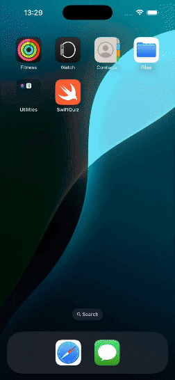

# swift-quiz-uikit

<h1 align="center">
  SwiftQuiz
</h1>

<p align="center">
  
  
  
  
</p>

<p align="center">
  <a href="#page_with_curl-sobre">Sobre</a>&nbsp;&nbsp;&nbsp;|&nbsp;&nbsp;&nbsp;
  <a href="#hammer-iniciando-ios">Tecnologias</a>
  &nbsp;&nbsp;&nbsp;|&nbsp;&nbsp;&nbsp;
  <a href="#books-requisitos">Requisitos</a>&nbsp;&nbsp;&nbsp;|&nbsp;&nbsp;&nbsp;
  <a href="#rocket-começando">Começando</a>&nbsp;&nbsp;&nbsp;
</p>

<h1 align="center">
  
</h1>

## 📃 Sobre

**SwiftQuiz** é um aplicativo de quiz simples criado para estudo de desenvolvimento iOS com **UIKit** e **Storyboard**. O app permite ao usuário testar seus conhecimentos, respondendo a perguntas de múltiplas escolhas, e exibe a pontuação final no final do quiz.

O objetivo deste projeto foi aprender e aprimorar habilidades no uso de **UIKit**, **navegação entre telas**, **controle de estado** e **interação com elementos de UI** em iOS.

## 🔨 Tecnologias

Este projeto foi desenvolvido com as seguintes tecnologias:

- [UIKit](https://developer.apple.com/documentation/uikit/)
- [Storyboard](https://developer.apple.com/xcode/storyboards/)
- [Swift](https://developer.apple.com/swift/)
- [Xcode](https://developer.apple.com/xcode/)
- [Git](https://git-scm.com/)

## 📚 Requisitos

- Ter o **Xcode** instalado.
- Um dispositivo ou simulador iOS.

## 🚀 Começando

```bash
  # Clonar o projeto:
  $ git clone https://github.com/Jhonata-Jackson/swift-quiz-uikit

  # Abrir o projeto no Xcode:
  $ open SwiftQuiz.xcodeproj
```

Feito por Jhonata Jackson 👋🏻 [Get in touch!](https://www.linkedin.com/in/jhonata-jackson-555929121/)